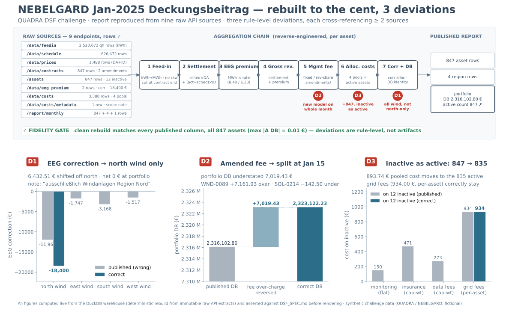

# challenge-quadra-portfolio-reporting-mismatch
Hiring challenge from QUADRA energy to identify portfolio reporting mismatch

Link to the challenge: https://poc16264.quadra-energy.com/challenge

## Solution at a glance



**What it shows.** The published Jan-2025 Deckungsbeitrag (contribution-margin) report for the
847-asset portfolio was reverse-engineered from the nine raw API endpoints (top band: sources →
seven aggregation steps → report). A clean rebuild reproduces **every published column for all
847 assets to the cent** (fidelity gate), which proves the aggregation rules are fully pinned —
so the exactly-three deviations are rule-level choices, not parsing or rounding artifacts. Each
deviation (red pin at the step where the rule breaks; bottom panels: published grey vs. correct
teal) is a point where the report's rule contradicts a **second** data source:

- **D1 — EEG correction spread too wide** (step 7). The −18,400 € wind Marktprämie correction was
  allocated capacity-weighted across *all* wind, but the cost-metadata note scopes it to north
  wind only ("ausschließlich Windanlagen Region Nord"). Cross-referenced: `/data/eeg_premium` ×
  `/data/costs/metadata` × `/data/contracts`. **6,432.51 €** shifted off north; portfolio net 0 €.
- **D2 — amended fee applied to the whole month** (step 5). Two contracts flipped
  `fixed → revenue_share` effective 2025-01-15; the report applied the new model to the entire
  month instead of time-splitting at the effective date. Cross-referenced: `/data/contracts`
  amendments × `/data/feedin` + `/data/prices`. Fees over-charged by a net **7,019.43 €** —
  the only deviation that moves the portfolio total (DB understated by the same amount).
- **D3 — 12 inactive assets counted as active** (step 6). Contracts that ended during January were
  still counted: `active_asset_count` 847 instead of 835, and the flat/capacity-weighted cost
  pools divided by 847. Cross-referenced: `/assets` `status` × `/data/costs`
  `active_assets_in_pool` × `/report/monthly`. **893.74 €** of pooled cost misallocated onto the
  inactive; portfolio net 0 € (grid fees are per-asset and correctly stay).

**How they were found:** trace one asset end-to-end, pin every aggregation rule until the rebuild
matches the report exactly, then flag each pinned rule that a second source contradicts. Details
in `DSF_SPEC.md` (deliverable) and `FINDINGS.md` (evidence ledger); regenerate the chart with
`python scripts/render_chart.py` — every figure is queried live from the warehouse and asserted
against the spec before rendering.

## Local Credentials

API credentials are stored locally in `.env`.

Expected variables (obtained from challenge webpage):

- `QUADRA_API_KEY`: sent to the API as the `X-API-Key` header.
- `QUADRA_ACCESS_CODE`: used for the challenge web login/submission flow.

Do not commit or paste credential values into documentation, logs, or submissions.

## Related documents

- **CHALLENGE.md** - extracted text from the challenge page for fast processing/indexing
- **PLAN.md** - current plan to solve/approach the challenge
- **FINDINGS.md** - append-only ledger of established facts, candidate deviations, and open rules
- **DSF_SPEC.md** - the deliverable: the 7-field DSF spec + the three identified deviations
- **plans/DATA_LOADING.md** - implementation spec for authenticated API extraction and immutable raw persistence
- **plans/STORAGE.md** - implementation spec for the DuckDB store (raw → normalized → reconciliation layers)
- **docs/solution_chart.svg** - one-chart summary (pipeline + the three deviations), rendered
  from the warehouse by `scripts/render_chart.py` with every figure asserted against `DSF_SPEC.md`

## Python Setup

Use Python 3.12 with a local virtual environment:

```bash
python3.12 -m venv .venv
source .venv/bin/activate
python -m pip install --upgrade pip
python -m pip install -r requirements.txt
```

Core project technology:

- DuckDB for hostless local analytical storage and all tabular transformations; a single
  engine keeps lineage auditable and lets the reconstruction SQL double as the DSF spec.
- requests and python-dotenv for authenticated API extraction.
- pytest for validation tests.
- Pydantic (optional) for ingest-boundary response validation.

See `plans/DATA_LOADING.md` and `plans/STORAGE.md` for the extraction and storage designs.

## Design Principles

Optimize for correctness, auditability, and speed; avoid platform-level abstraction.

- Components: separate API extraction, raw storage, normalization, reconciliation, validation, and reporting.
- Storage: preserve immutable raw API extracts; persist normalized/derived analytical tables in DuckDB.
- Compute: use DuckDB SQL as the single transform engine; avoid obscuring lineage by mixing engines unnecessarily.
- Types: use Pydantic/typed schemas for config, endpoint params, response validation, and domain records.
- Validation: fail on missing credentials, incomplete pagination, schema drift, bad enums, duplicate keys, unit/date errors, or unexpected nulls.
- Logic: keep formulas explicit and testable, especially unit conversion, hourly aggregation, joins, contract amendments, allocation denominators, and rounding.
- Reproducibility: final outputs must rebuild from raw data via scripts/queries; notebooks are exploratory only.
- Precision: calculate at full precision; round only at report comparison/output boundaries.
- Scope: add abstractions only when they reduce duplication, isolate a real boundary, or improve tests.
- Assumptions: document inferred business rules with the source fields/report comparisons that justify them.
